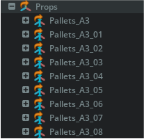
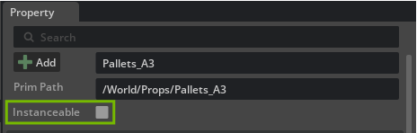
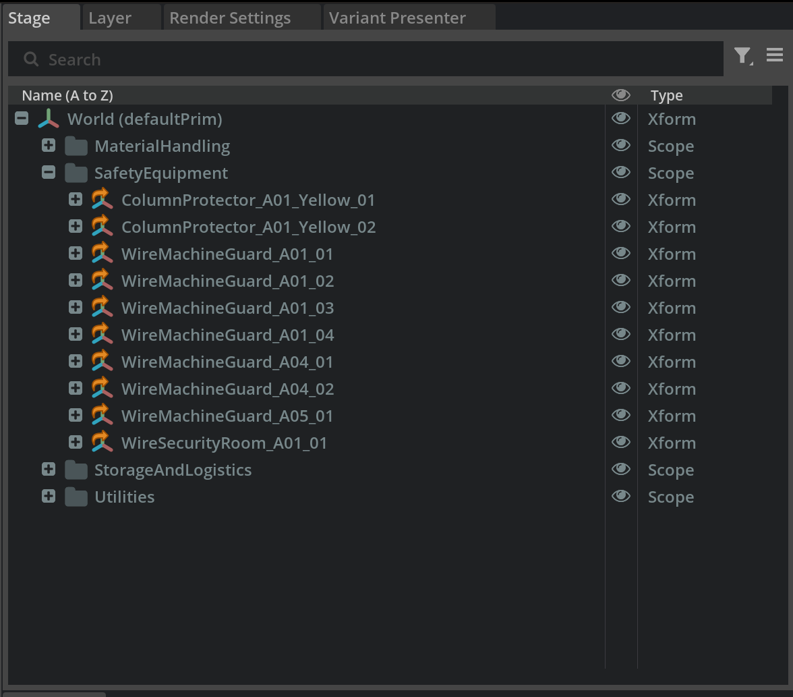

# Guideline 03: Instancing and Scopes (Optimization)

As an Air Field grows, repetitive objects will decimate viewport performance. A large airport tarmac can contain thousands of identical warning cones, runway lights, baggage carts, and perimeter fences. Traditional referencing breaks down at this scale.

## 1. Instancing Architecture Contract

Instancing is USD's solution to repetitive loading. It loads a single **Prototype** (the blueprint) in memory and generates thousands of lightweight **Instances** (pointers) pointing to it.

To execute this correctly:

1. **The Prototype:** Store the heavy asset (the Component USD) under a designated prototype scope (e.g., `/World/Prototypes/Safety_Cone_A`).
2. **The Instances:** Generate the layout pointers (e.g., `/World/Stage/SafetyEquipment/Cone_...`).
3. **The Toggle:** Place the `instanceable = true` metadata flag *precisely on the pointers*. Never place it on the Prototype itself.

## 2. Organizing Asset Groups with Scopes

To maintain a clean hierarchy and allow teams to work efficiently on different sublayers, use **Scope** primitives to group assets logically.

### Example Case 04 Scope Hierarchy

* `/World/Stage/`
  * `/World/Stage/Terrain` (The ground mesh)
  * `/World/Stage/Terminals` (Main architectural buildings)
  * `/World/Stage/SafetyEquipment` (Instanced cones, barriers, warning lines)
  * `/World/Stage/Utilities` (Runway edge lights, floodlights)
  * `/World/Stage/LogisticsProps` (Pallets, parked baggage carts)

* `/World/Factory/`
  * `/World/Factory/Tankers` (Dynamic TZ-22 agents)
  * `/World/Factory/Aircraft` (Dynamic airplane agents)

## 3. Decision Framework for Instancing

Use this framework before adding an asset:

1. **Count:** Do you have 3 or more identical objects?
2. **Complexity:** Is the object geometrically or materially complex?
3. **Stability:** Will the objects remain largely unchanged once placed?
4. **Customization:** Do they all share the exact same properties (except position/rotation)?

If "Yes" to the above, **use an Instance**. If each vehicle requires unique simulation data (e.g., unique fuel sloshing liquids, unique dirt maps), instances are inappropriate.

---

## ✅ Definition of Done (DoD)

* [ ] The `instanceable=true` tag is verified on all repetitive Prop pointers, not the Prototype.
* [ ] USD Stage statistics confirm a high Instance-to-Prototype ratio for static clutter.
* [ ] All instances and references are neatly organized under logical `Scope` containers like `/SafetyEquipment`.
