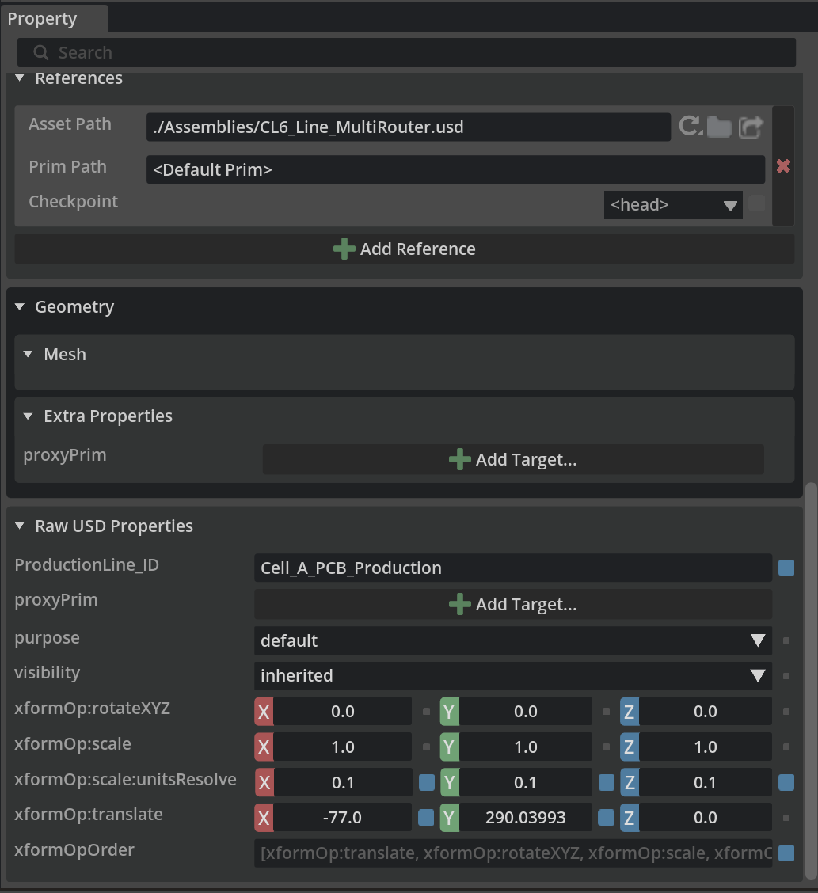
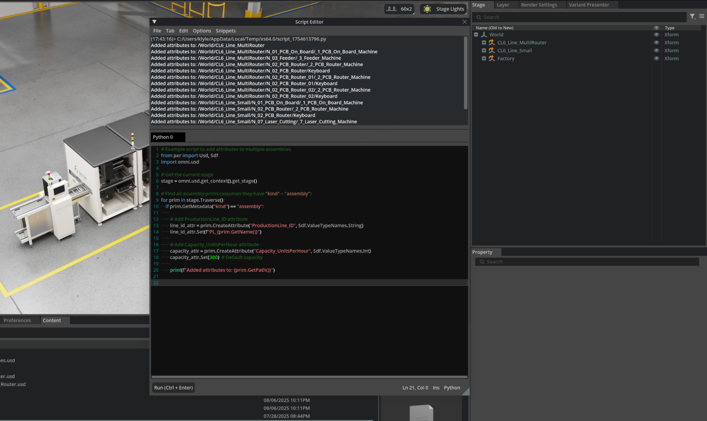

# Guideline 04: Telemetry and VRP Attributes

This is the core differentiating factor of Case 04: Air Field. To visualize the **Vehicle Routing Problem (VRP)**—calculating optimal refueling orders and tanker routes—the USD objects themselves must hold semantic data.

We leverage **Primvars (Primitive Variables)** strictly defined by a formal schema. This allows external Python solvers (the dispatch logic) to read the need, and the Hydra render engine (the FUI/HUD) to visualize the status via shader heatmaps.

## 1. The VRP Telemetry Schema Contract (v1.0)

All target aircraft and servicing vehicles must carry the following primvars in their root definition. By using the `primvars:` namespace, this data flows instantly to the renderer.

### `primvars:telemetry:schemaVersion` = `"1.0"` (String)

* **What it is:** Ensures compatibility with Python routing scripts.

### `primvars:vehicle:id` (String)

* **What it is:** Unique node identifier matching the Dispatch logs.
* **Example:** `"TZ22_01"`, `"FLIGHT_773"`

### `primvars:logistics:status` (String)

* **What it is:** The current state of the agent in the simulation.
* **Valid States:** `"Idle"`, `"Transit"`, `"Refueling"`, `"Maintenance"`.

### `primvars:logistics:fuelNeeded` (Float)

* **What it is:** Specific to Aircraft. The required volume of jet fuel needed for departure. A solver uses this to determine if a single TZ-22 has enough capacity, or if two dispatchers are required.
* **Example:** `15000.0` (Liters)

### `primvars:logistics:fuelCurrent` (Float)

* **What it is:** The real-time fuel payload. For a TZ-22, this starts high and drains. For an Aircraft, this starts low and fills.
* **Example:** `35000.0` (Liters)

### `primvars:logistics:priority` (Integer)

* **What it is:** Critical for routing urgency. `1` (Highest, imminent departure) to `5` (Lowest, overnight parking).

## 2. Connecting Data to Visuals (FUI/HUD)

Standard metadata dictionaries cannot be read directly by MDL/USD Preview Surface shaders. **Primvars can.**

By encoding `fuelNeeded` and `priority` as primvars on target planes, an overarching Omniverse extension can automatically generate bounding-box HUDs (FUI) over the planes, color-coding them (Red for High Priority, Blue for Idle) simply by reading the primitive's state.

---

## ✅ Definition of Done (DoD)

* [ ] The `primvars:telemetry:schemaVersion` attribute string returns `"1.0"` upon inspection.
* [ ] Telemetry data (`status`, `fuelNeeded`) exists directly in the `primvars:` namespace, **not** inside standard user `customData`.
* [ ] Vehicles and Planes correctly declare their unique `primvars:vehicle:id`.
* [ ] Python dispatch scripts can algorithmically query these exact keys to compute the shortest path.
